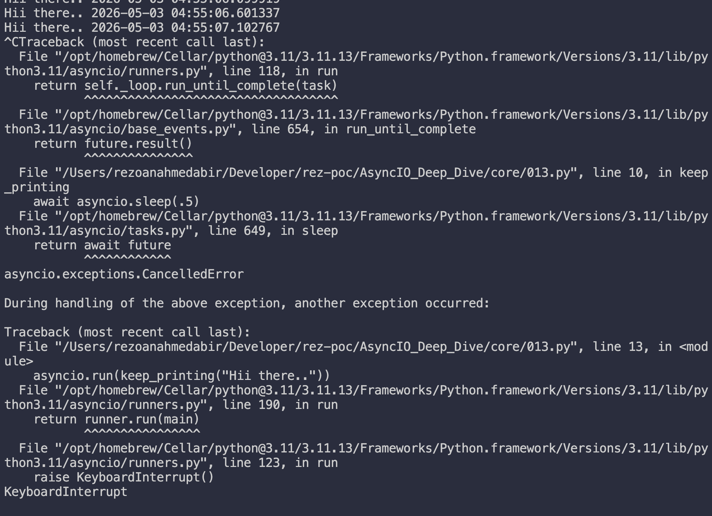
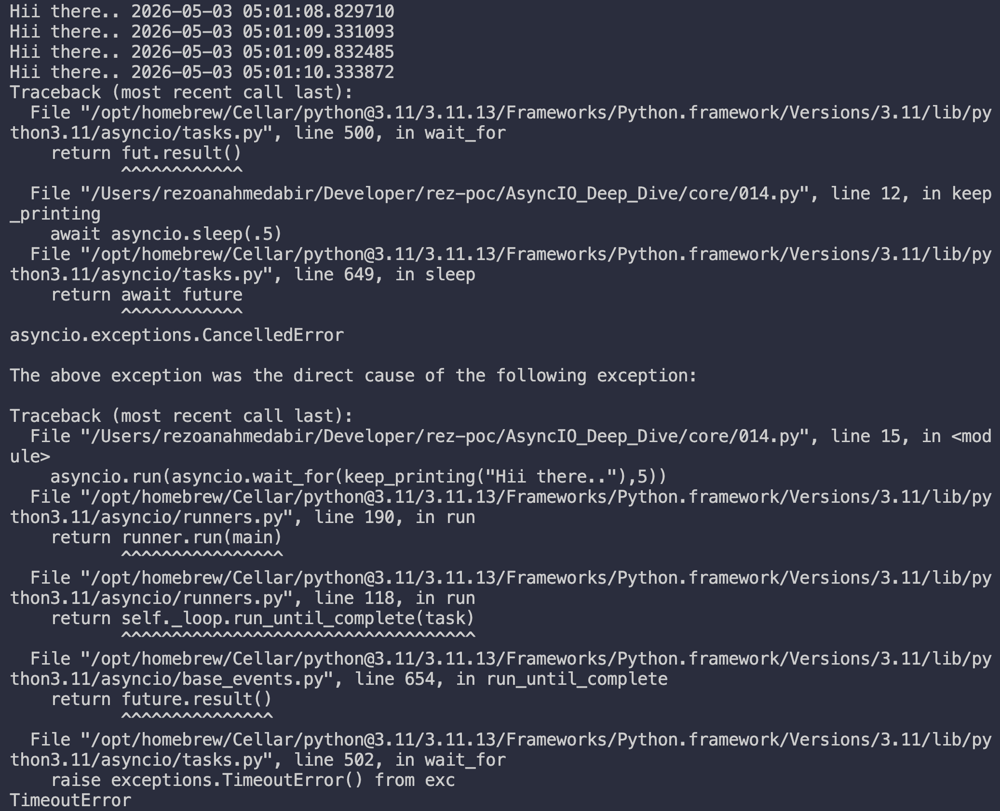
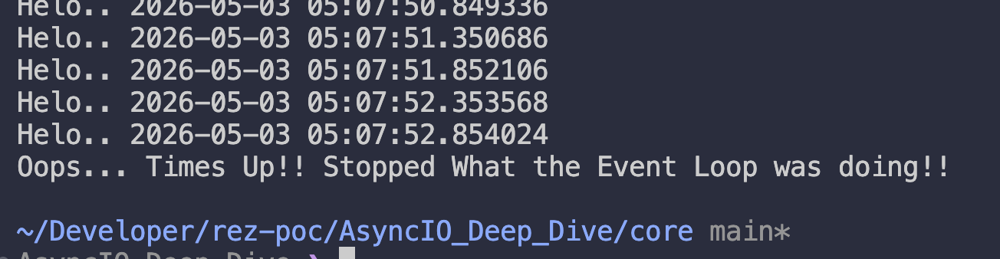
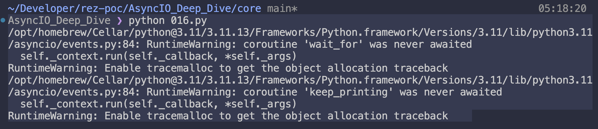
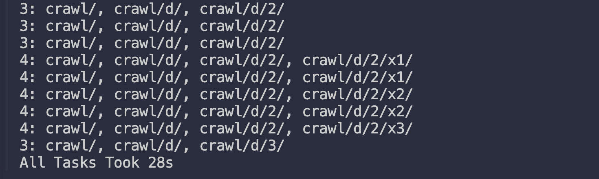

# asyc/await Fundamentals

---

## Table of Contents

1. [Overview](#overview)
2. [Prerequisites](#prerequisites)
3. [Project Structure](#project-structure)
4. [Chapter Breakdown & Code Reference](#chapter-breakdown--code-reference)
   - [Chapter 1 — Your First Async Function](#chapter-1--your-first-async-function)
   - [Chapter 2 — Timeouts with `asyncio.wait_for`](#chapter-2--timeouts-with-asynciowait_for)
   - [Chapter 3 — Graceful Exception Handling & `async_main`](#chapter-3--graceful-exception-handling--async_main)
   - [Chapter 4 — Awaitables, Coroutines vs Async Functions](#chapter-4--awaitables-coroutines-vs-async-functions)
   - [Chapter 5 — Coroutine Types & Single-Run Constraint](#chapter-5--coroutine-types--single-run-constraint)
   - [Chapter 6 — Concurrent Composition with `asyncio.gather`](#chapter-6--concurrent-composition-with-asynciogather)
   - [Chapter 7 — Cancellations & `CancelledError`](#chapter-7--cancellations--cancellederror)
   - [Chapter 8 — Web Crawler: Tasks & `asyncio.create_task`](#chapter-8--web-crawler-tasks--asynciocreate_task)
   - [Chapter 9 — Graceful Shutdown with `asyncio.wait`](#chapter-9--graceful-shutdown-with-asynciowait)
5. [Crawl Server (Node.js)](#crawl-server-nodejs)
6. [Key Concepts Glossary](#key-concepts-glossary)
7. [Awaitable Class Hierarchy](#awaitable-class-hierarchy)
8. [Concurrency vs Parallelism](#concurrency-vs-parallelism)
9. [Debugging Tips](#debugging-tips)
10. [Performance Benchmark](#performance-benchmark)
11. [Common Pitfalls](#common-pitfalls)

---

## Overview

This document is an engineering reference for all code written in Episode 3 of the *import async io* series. The episode introduces the `async`/`await` keywords in Python and progressively builds up from a basic infinite loop coroutine to a fully concurrent web crawler with graceful shutdown handling.

The core theme of the episode is **cooperative multitasking on a single thread**, how Python's `asyncio` event loop can run many things concurrently without threads or processes, purely through coroutine suspension and resumption.

---

## Prerequisites

**Python**
```bash
pip install httpx
```

**Node.js** (for the crawl server)
```bash
node crawl-server.js
```

**Environment variables for debugging** (strongly recommended during development):
```bash
export PYTHONASYNCIODEBUG=1
export PYTHONTRACEMALLOC=1
```

| Variable | Purpose |
|---|---|
| `PYTHONASYNCIODEBUG=1` | Warns about unawaited coroutines and other async misuse |
| `PYTHONTRACEMALLOC=1` | Shows exact source location where an awaitable object was created |
| `python -X dev` | Enables Python dev mode (does not enable tracemalloc by default) |

---

## Project Structure

```
.
├── README.md
├── crawl_server.js                             # Node.js link graph server (run this first)
├── 01.basic_async.py                           # Chapter 1 — first async function
├── 02.wait_for_with_timeout.py                 # Chapter 2 — wait_for with timeout
├── 03.create_entrypoint.py                     # Chapter 3 — async_main entry point pattern
├── 04.awaitables.py                            # Chapter 4 — awaitable objects
├── 05.async_function_vs_coroutine.py           # Chapter 5 — async fn vs coroutine types
├── 06.gather.py                                # Chapter 6 — asyncio.gather concurrency
├── 07.error_handling.py                        # Chapter 7 — CancelledError handling
├── 08.intro_to_tasks.py                        # Chapter 8 — web crawler with create_task
└── 09.tasks_with_graceful_shutdown.py          # Chapter 9 — graceful shutdown with asyncio.wait
```

---

## Chapter Breakdown & Code Reference

---

### Chapter 1 — Your First Async Function

**File:** `01.basic_async.py`

```python
from datetime import datetime
import asyncio

def print_now():
    print(datetime.now())

async def keep_printing(name: str) -> None:
    while True:
        print(name, end=" ")
        print_now()
        await asyncio.sleep(.5)

# Without ctrl+c it won't stop
asyncio.run(keep_printing("Hii there.."))
```

**What this demonstrates:**

- `async def` compiles a function as asynchronous, enabling the use of `await` inside it.
- `asyncio.run()` is the standard entry point to start the event loop and run a coroutine until completion.
- `await asyncio.sleep(.5)` does two things simultaneously:
  1. **Blocks further execution** of `keep_printing` for at least 0.5 seconds.
  2. **Yields control back to the event loop**, allowing other coroutines to run in the meantime.
- The `while True` loop runs forever — you must `Ctrl+C` to stop it.
- Note: all time-based values in asyncio are minimums, not guarantees. The single-threaded event loop cannot provide real-time precision.



---

### Chapter 2 — Timeouts with `asyncio.wait_for`

**File:** `02.wait_for_with_timeout.py`

```python
from datetime import datetime
import asyncio

def print_now():
    print(datetime.now())

async def keep_printing(name: str) -> None:
    while True:
        print(name, end=" ")
        print_now()
        await asyncio.sleep(.5)

# Will throw a TimeoutError exception after 5 seconds
asyncio.run(asyncio.wait_for(keep_printing("Hii there.."), 5))
```

**What this demonstrates:**

- `asyncio.wait_for(coro, timeout)` wraps any awaitable and enforces a maximum execution time in seconds.
- When the timeout expires, it raises `asyncio.TimeoutError` and **cancels** the wrapped coroutine.
- The exception propagates up unless caught — here it produces a traceback.
- This is the direct and raw form; see Chapter 3 for the graceful version.

**Key behavior:**

```
asyncio.wait_for
    └── keep_printing   ← cancelled when timeout fires
            └── asyncio.sleep  ← CancelledError raised here
```


---

### Chapter 3 — Graceful Exception Handling & `async_main`

**File:** `03.create_entrypoint.py`

```python
from datetime import datetime
import asyncio

def print_now():
    print(datetime.now())

async def keep_printing(name: str) -> None:
    while True:
        print(name, end=" ")
        print_now()
        await asyncio.sleep(.5)

async def async_main():
    try:
        await asyncio.wait_for(keep_printing("Helo.."), 3)
    except asyncio.TimeoutError:
        print("Oops... Times Up!! Stopped What the Event Loop was doing!!")

asyncio.run(async_main())
```

**What this demonstrates:**

- **The `async_main` pattern**: defining an `async def main()` as the single entry point to the asynchronous world is a common and recommended convention in real-world asyncio applications.
- `try/except asyncio.TimeoutError` cleanly handles the timeout without an ugly traceback.
- Exceptions in asyncio (including `TimeoutError` and `CancelledError`) are regular Python exceptions and compose naturally with `try/except/finally` blocks. This is by design.



---

### Chapter 4 — Awaitables

**File:** `04.awaitables.py`

```python
from datetime import datetime
import asyncio

def print_now():
    print(datetime.now())

async def keep_printing(name: str) -> None:
    while True:
        print(name, end=" ")
        print_now()
        await asyncio.sleep(.5)

async def async_main():
    # Awaitable objects — nothing runs yet just by creating them
    aw_kp = keep_printing("Hey..")
    aw_wf = asyncio.wait_for(aw_kp, 3)  # doesn't start counting seconds

    try:
        await aw_wf   # NOW it starts running and counting
        aw_wf         # forgetting await — this does nothing, just evaluates the variable
    except asyncio.TimeoutError:
        print("Oops... Times Up!! Stopped What the Event Loop was doing!!")

asyncio.run(async_main())
```

**What this demonstrates:**

- An **awaitable** is any object that can be placed in an `await` expression. The three main kinds are: coroutines, tasks, and futures.
- **Creating** an awaitable object (e.g. `keep_printing("Hey..")`) does NOT start execution. It merely instantiates the object.
- **Only `await`-ing** an awaitable starts execution.
- `aw_wf` on its own (without `await`) is a no-op — a very common beginner bug.
- asyncio will warn you about unawaited coroutines if you enable `PYTHONASYNCIODEBUG=1`. Without it, the warning is silently dropped.

**Enable warnings:**
```bash
PYTHONASYNCIODEBUG=1 PYTHONTRACEMALLOC=1 python 04_awaitables.py
```

---

### Chapter 5 — Coroutines vs Async Functions

**File:** `05.async_function_vs_coroutine.py`

```python
from datetime import datetime
import asyncio

def print_now():
    print(datetime.now())

async def print_3_time(name: str) -> None:
    for i in range(3):
        print(f"{name} {i} !!")
        print_now()
        await asyncio.sleep(.5)

coro_1 = print_3_time('Hi')
coro_2 = print_3_time('Helo')

print(type(print_3_time))  # <class 'function'>  (async function definition)
print(type(coro_1))        # <class 'coroutine'> (coroutine object)

# asyncio.run(print_3_time)   # ERROR: coroutine expected, got function
asyncio.run(coro_1)           # OK
asyncio.run(coro_2)           # OK

# asyncio.run(coro_1)         # ERROR: coroutines can only be awaited once
```

**What this demonstrates:**

- An **async function** (`async def`) is a regular function object. `type(print_3_time)` returns `<class 'function'>`.
- A **coroutine** is the object returned when you *call* an async function. `type(coro_1)` returns `<class 'coroutine'>`.
- `asyncio.run()` expects a coroutine object, not the function itself.
- **A coroutine can only be awaited once.** Once exhausted, it cannot be re-used. To run the same logic again, call the async function again to get a fresh coroutine.

| Concept | Definition | Awaitable? |
|---|---|---|
| Async function | `async def` definition | ❌ No |
| Coroutine | Object from calling async function | ✅ Yes |
| Task | Scheduled coroutine on the event loop | ✅ Yes |
| Future | Low-level result placeholder | ✅ Yes |

---

### Chapter 6 — Concurrent Composition with `asyncio.gather`

**File:** `06.gather.py`

```python
from datetime import datetime
import asyncio

def print_now():
    print(datetime.now())

async def keep_printing(name):
    while True:
        print(name, end=" ")
        print_now()
        await asyncio.sleep(.5)

async def async_main():
    # Sequential — second won't start until first finishes (which is never here)
    # await keep_printing("one")
    # await keep_printing("two")
    # await keep_printing("three")

    # Concurrent — all three run interleaved on the same single thread
    await asyncio.gather(
        keep_printing('one'),
        keep_printing('two'),
        keep_printing('three')
    )

asyncio.run(async_main())
```

**What this demonstrates:**

- `asyncio.gather(*coroutines)` runs multiple awaitables **concurrently** — they interleave on the event loop.
- This is **not parallel** (no threads, no processes). It is cooperative multitasking: one coroutine runs, hits an `await`, and yields so another can proceed.
- Sequential `await` calls would execute one-by-one. `gather` is the idiomatic solution to run many coroutines "at the same time" on a single thread.
- `gather` returns a coroutine itself, which you `await` on.

**Mental model:**
```
Event Loop tick:
  → one   hits await asyncio.sleep → yields
  → two   hits await asyncio.sleep → yields
  → three hits await asyncio.sleep → yields
  → one   resumes after sleep
  → two   resumes after sleep
  ...
```

---

### Chapter 7 — Error Handling
**File:** `07.error_handling.py`

```python
from datetime import datetime
import asyncio

def print_now():
    print(datetime.now())

async def keep_printing(name):
    while True:
        print(name, end=" ")
        print_now()
        try:
            await asyncio.sleep(.5)
        except asyncio.CancelledError:
            print(f'{name} cancelled')
            break

async def async_main():
    try:
        # Cancellation chain:
        # wait_for times out → cancels gather → gather cancels each keep_printing
        # → CancelledError raised at each await expression inside keep_printing
        await asyncio.wait_for(
            asyncio.gather(
                keep_printing('one'),
                keep_printing('two'),
                keep_printing('three')
            ),
            3
        )
    except asyncio.TimeoutError:
        print("oops!! time's up")

asyncio.run(async_main())
```

**What this demonstrates:**

The full cancellation propagation chain:

```
asyncio.wait_for (timeout=3)
    └── asyncio.gather
            ├── keep_printing('one')   ← CancelledError raised at await asyncio.sleep
            ├── keep_printing('two')   ← CancelledError raised at await asyncio.sleep
            └── keep_printing('three') ← CancelledError raised at await asyncio.sleep
```

1. `wait_for` fires after 3 seconds → **cancels** the `gather` coroutine.
2. `gather`, when cancelled, **propagates cancellation** to all submitted awaitables not yet done.
3. Each `keep_printing` coroutine receives a `CancelledError` at its currently-suspended `await asyncio.sleep(.5)`.
4. Catching `CancelledError` inside the coroutine allows for **cleanup before stopping**.

**Design note:** Making cancellations Python exceptions is an intentional, elegant design. It means standard `try/except/finally` blocks handle cleanup for both normal exceptions and cancellation uniformly.

> ⚠️ If you catch `CancelledError`, you must either `break`/`return` or `raise` it again. Swallowing it without re-raising or exiting means the coroutine will continue running and the cancel request is silently ignored, which is almost always a bug.

---

### Chapter 8 — Tasks Intro

**File:** `08.intro_to_tasks.py`

```python
import httpx
import asyncio
import time
from collections.abc import Callable, Coroutine


async def crawl_base(prefix: str, url: str = "") -> None:
    """
    Naive version: sequential recursive crawl.
    Very slow — each URL blocks the next.
    """
    url = url or prefix
    print(f"[crawling] {url}")
    client = httpx.AsyncClient()
    try:
        res = await client.get(url)
    finally:
        await client.aclose()

    for line in res.text.splitlines():
        if line.startswith(prefix):
            await crawl_base(prefix, line)  # sequential — one at a time


async def track_progress(
        url: str,
        handler: Callable[..., Coroutine]) -> None:
    """
    Progress reporter. Creates the root crawl task and polls todo set every 0.5s.
    """
    asyncio.create_task(handler(url), name=url)
    todo.add(url)
    start = time.time()
    while len(todo):
        _todo = [x.split('3000/')[-1] for x in todo]
        print(f'{len(todo)}: {", ".join(sorted(_todo))}')
        await asyncio.sleep(.5)
    end_ = time.time()
    print(f'All Tasks Took {int(end_ - start)}s')


todo = set()


async def crawl_intermediate(prefix: str, url: str = "") -> None:
    """
    Adds URL tracking but still sequential.
    """
    url = url or prefix
    client = httpx.AsyncClient()
    try:
        res = await client.get(url)
    finally:
        await client.aclose()
    for line in res.text.splitlines():
        todo.add(line)
        await crawl_intermediate(prefix, line)
    todo.discard(url)


async def crawl_beast(prefix: str, url: str = "") -> None:
    """
    Concurrent version using asyncio.create_task.
    Each discovered URL is immediately scheduled as a background task.
    Result: ~7x faster than sequential on the same connection.
    """
    url = url or prefix
    client = httpx.AsyncClient()
    try:
        res = await client.get(url)
    finally:
        await client.aclose()

    for line in res.text.splitlines():
        todo.add(line)
        asyncio.create_task(
            coro=crawl_beast(prefix, line),
            name=line
        )
    todo.discard(url)


asyncio.run(track_progress(
    url='http://localhost:3000/crawl/',
    handler=crawl_beast
))
```

**What this demonstrates:**

Three generations of the crawler, each improving on the last:

| Version | Strategy | Speed |
|---|---|---|
| `crawl_base` | Recursive `await` — fully sequential | ~28s |
| `crawl_intermediate` | Adds `todo` set tracking, still sequential | ~28s |
| `crawl_beast` | `create_task` per URL — fully concurrent | ~5s |

**`asyncio.create_task()` explained:**

- Schedules a coroutine to run on the event loop **immediately in the background** without awaiting it.
- Returns a `Task` object (a handle you can use to cancel, inspect, or await the task later).
- The task only executes during gaps when the current coroutine is suspended at an `await`.
- Always provide a `name=` argument — it makes debugging much easier.

```python
# This fires and forgets — task runs in background
asyncio.create_task(coro=crawl_beast(prefix, line), name=line)

# vs. this — waits for it to complete before moving on
await crawl_beast(prefix, line)
```


---

### Chapter 9 — Graceful Shutdown with `asyncio.wait`

**File:** `09.tasks_with_graceful_shutdown.py`

```python
import httpx
import asyncio
import time
from collections.abc import Callable, Coroutine


async def track_progress(
        url: str,
        handler: Callable[..., Coroutine]) -> None:
    """
    Cleaner version: todos holds actual Task objects, not raw URL strings.
    Uses asyncio.wait() instead of asyncio.sleep() for progress polling.
    """
    task = asyncio.create_task(handler(url), name=url)
    todos.add(task)
    start = time.time()
    while len(todos):
        done, _pending = await asyncio.wait(todos, timeout=13)
        todos.difference_update(done)
        _todos = [x.get_name().split('3000/')[-1] for x in todos]
        print(f'{len(todos)}: {", ".join(sorted(_todos))}')
    end_ = time.time()
    print(f'All Tasks Took {int(end_ - start)}s')


todos = set()


async def crawl_beast(prefix: str, url: str = "") -> None:
    url = url or prefix
    client = httpx.AsyncClient()
    try:
        res = await client.get(url)
    finally:
        await client.aclose()

    for line in res.text.splitlines():
        task = asyncio.create_task(
            coro=crawl_beast(prefix, line),
            name=line
        )
        todos.add(task)


async def async_main() -> None:
    """
    Handles graceful cancellation of all background tasks when interrupted.
    Also covers the edge case of new tasks being created mid-cancellation.
    """
    try:
        await track_progress(
            url='http://localhost:3000/crawl/',
            handler=crawl_beast
        )
    except asyncio.CancelledError:
        for task in todos:
            task.cancel()
        done, _pending = await asyncio.wait(todos, timeout=1)
        todos.difference_update(done)
        todos.difference_update(_pending)
        if todos:
            print('[warning] during cancellation new tasks were added to the loop!!!')


# Manual event loop control — allows us to schedule cancellation at a specific time
loop = asyncio.get_event_loop()
main_task = loop.create_task(async_main())
loop.call_later(2.5, main_task.cancel)   # cancel after 2.5 seconds
loop.run_until_complete(main_task)
```

**What this demonstrates:**

**`asyncio.wait()` vs `asyncio.wait_for()`:**

| Feature | `asyncio.wait_for` | `asyncio.wait` |
|---|---|---|
| Takes | Single awaitable | Collection of awaitables |
| On timeout | Raises `TimeoutError` | Returns `(done, pending)` sets |
| Cancels on timeout | Yes | No |
| Best for | Hard deadlines | Progress polling / partial completion |

**Graceful shutdown pattern:**

```python
except asyncio.CancelledError:
    # Step 1: Cancel all known background tasks
    for task in todos:
        task.cancel()

    # Step 2: Give them a chance to finish cleanup (timeout=1s)
    done, _pending = await asyncio.wait(todos, timeout=1)

    # Step 3: Remove completed and timed-out pending tasks
    todos.difference_update(done)
    todos.difference_update(_pending)

    # Step 4: Warn if new tasks were spawned mid-cancellation
    if todos:
        print('[warning] during cancellation new tasks were added to the loop!!!')
```

**Why the warning matters:**

`asyncio.create_task()` is not awaitable — it schedules immediately. During the cancellation window between step 1 and step 3, a task that was being cancelled could itself spawn new background tasks before it stopped. This edge case requires multiple passes or a loop to fully drain all pending tasks for a truly clean shutdown.

**Manual event loop pattern:**

```python
loop = asyncio.get_event_loop()
main_task = loop.create_task(async_main())
loop.call_later(2.5, main_task.cancel)   # schedule cancellation in 2.5s
loop.run_until_complete(main_task)
```

This is an alternative to `asyncio.run()` when you need low-level control over the event loop — for example, scheduling a cancellation at a specific future time using `call_later`.

---

## Crawl Server (Node.js)

**File:** `crawl_server.js`

A local HTTP server that simulates a link graph with artificial network latency.

**Start the server:**
```bash
node crawl-server.js
```

**Configuration:**

| Setting | Value |
|---|---|
| Host | `localhost` |
| Port | `3000` |
| Base URL | `http://localhost:3000/crawl/` |
| Response delay | 300ms – 1200ms (random per request) |
| Response format | Plain text, one absolute URL per line |

**Graph structure:**

```
/crawl/
├── /crawl/a/
│   ├── /crawl/a/1/
│   │   ├── /crawl/a/1/x1/   (dead end)
│   │   └── /crawl/a/1/x2/   (dead end)
│   ├── /crawl/a/2/
│   │   ├── /crawl/a/2/x1/   (dead end)
│   │   └── /crawl/a/2/x2/   (dead end)
│   └── /crawl/a/3/          (dead end)
├── /crawl/b/
│   ├── /crawl/b/1/
│   │   ├── /crawl/b/1/x1/   (dead end)
│   │   ├── /crawl/b/1/x2/   (dead end)
│   │   └── /crawl/b/1/x3/   (dead end)
│   ├── /crawl/b/2/          (dead end)
│   └── /crawl/b/3/
│       ├── /crawl/b/3/x1/   (dead end)
│       └── /crawl/b/3/x2/   (dead end)
├── /crawl/c/
│   ├── /crawl/c/1/          (dead end)
│   ├── /crawl/c/2/
│   │   └── /crawl/c/2/x1/
│   │       └── /crawl/c/2/x1/omega/  (dead end)
│   └── /crawl/c/3/
│       ├── /crawl/c/3/x1/   (dead end)
│       ├── /crawl/c/3/x2/   (dead end)
│       └── /crawl/c/3/x3/   (dead end)
└── /crawl/d/
    ├── /crawl/d/1/
    │   ├── /crawl/d/1/x1/   (dead end)
    │   └── /crawl/d/1/x2/   (dead end)
    ├── /crawl/d/2/
    │   ├── /crawl/d/2/x1/   (dead end)
    │   ├── /crawl/d/2/x2/   (dead end)
    │   └── /crawl/d/2/x3/   (dead end)
    └── /crawl/d/3/          (dead end)
```

Total nodes: 35 | Dead ends: 24 | Max depth: 4

---

## Key Concepts Glossary

| Term | Definition |
|---|---|
| **Async function** | A function defined with `async def`. Not itself awaitable. Creates coroutines when called. |
| **Coroutine** | An object created by calling an async function. Awaitable. Can only be awaited once. |
| **Awaitable** | Any object usable in an `await` expression. Includes coroutines, tasks, and futures. |
| **Task** | A coroutine scheduled on the event loop via `asyncio.create_task()`. Runs in the background. |
| **Future** | A low-level placeholder for a result not yet available. Tasks are a subclass of Future. |
| **Event loop** | The scheduler that drives all coroutine execution. Runs on a single thread. |
| **Cooperative multitasking** | Coroutines voluntarily yield execution at `await` points, allowing others to run. |
| **`asyncio.gather()`** | Runs multiple awaitables concurrently. Cancels all if itself is cancelled. |
| **`asyncio.wait()`** | Waits on a set of tasks. Returns `(done, pending)`. Does not raise on timeout. |
| **`asyncio.wait_for()`** | Waits on a single awaitable with a timeout. Raises `TimeoutError` and cancels on expiry. |
| **`CancelledError`** | Exception raised inside a coroutine at its current `await` point when cancelled. |

---

## Awaitable Class Hierarchy

```
collections.abc.Awaitable          (built into Python)
├── collections.abc.Coroutine      (built into Python)
└── asyncio.Future                 (asyncio framework)
    └── asyncio.Task               (asyncio framework)
```

- `Awaitable` and `Coroutine` are core Python — framework-agnostic.
- `Future` and `Task` are asyncio-specific. Other frameworks (Trio, Curio, Twisted) have their own equivalents.

---

## Concurrency vs Parallelism

This entire series operates on **concurrency, not parallelism**:

| | Concurrency | Parallelism |
|---|---|---|
| **Threads** | Single thread | Multiple threads/processes |
| **Execution** | Interleaved (one at a time) | Truly simultaneous |
| **Mechanism** | Cooperative `await` yields | OS-level scheduling |
| **asyncio** | ✅ Yes | ❌ No |

The web crawler benchmark (Chapter 8) achieves **~17x speedup** over the sequential version while remaining entirely single-threaded. This is possible because most of the time is spent waiting for network I/O — and `asyncio` fills that wait time with other useful work.

---

## Debugging Tips

```bash
# Enable all asyncio warnings
PYTHONASYNCIODEBUG=1 PYTHONTRACEMALLOC=1 python your_script.py

# Python dev mode (does NOT include tracemalloc by default)
python -X dev your_script.py
```

**Common asyncio warnings you'll encounter:**

| Warning | Cause |
|---|---|
| `coroutine was never awaited` | Called an async function but forgot `await` |
| `destroy pending task` | A Task was garbage-collected before it finished |
| `exception was never retrieved` | A task raised an exception nobody caught |

**Task naming best practice:**

Always name your tasks — it makes logs and warnings dramatically easier to read:
```python
asyncio.create_task(coro=my_coroutine(), name="descriptive-name-here")
```

---

## Performance Benchmark

Crawling the full local graph (35 nodes, 300–1200ms delay per node):

| Crawler version | Strategy | Time |
|---|---|---|
| `crawl_base` | Sequential recursive `await` | ~28 seconds |
| `crawl_intermediate` | Sequential + todo tracking | ~28 seconds |
| `crawl_beast` | `create_task` per URL (concurrent) | ~5 seconds |

**Speedup: ~17x, on a single thread, zero parallelism.**

---

## Common Pitfalls

**1. Forgetting `await`**
```python
# Bug — creates a coroutine object, does nothing
keep_printing("hello")

# Correct
await keep_printing("hello")
```

**2. Awaiting the same coroutine twice**
```python
coro = keep_printing("hello")
await coro   # OK
await coro   # RuntimeError: cannot reuse already awaited coroutine
```

**3. Swallowing `CancelledError`**
```python
# Bug — cancellation silently ignored, task keeps running
try:
    await asyncio.sleep(1)
except asyncio.CancelledError:
    pass  # ← WRONG: must break, return, or re-raise

# Correct
try:
    await asyncio.sleep(1)
except asyncio.CancelledError:
    print("cleaning up...")
    break  # or raise, or return
```

**4. Using `await` on an async function instead of its coroutine**
```python
# Bug
await keep_printing   # TypeError: object function can't be used in await

# Correct
await keep_printing("hello")
```

**5. Assuming cancellation is instantaneous**

`create_task()` is not awaitable. Between cancellation requests, background tasks may still be running and may even spawn new tasks. Robust shutdown code must loop or do multiple passes to drain the task set completely.

---