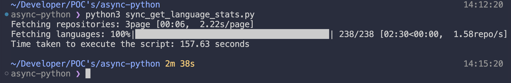
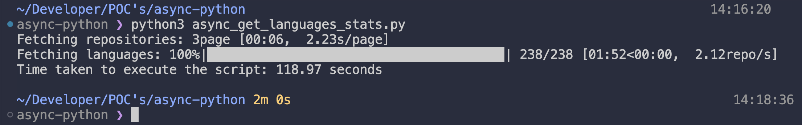
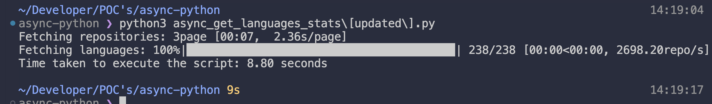
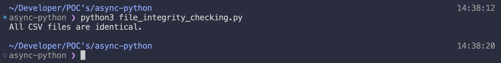

# GitHub Language Stats Fetcher

This project demonstrates different approaches to fetch language statistics from GitHub repositories, comparing synchronous and asynchronous implementations.

## Implementation Approaches

### 1. Synchronous Implementation (`sync_get_language_stats.py`)
- Uses the `requests` library for HTTP calls
- Sequential execution of API calls
- Simple to understand and implement
- Suitable for small-scale data fetching

### 2. Basic Async Implementation (`async_get_languages_stats.py`)
- Uses `aiohttp` for asynchronous HTTP calls
- Sequential processing within async context
- Better performance than synchronous version
- Maintains single session for all requests

### 3. Optimized Async Implementation (`async_get_languages_stats[updated].py`)
- Uses `aiohttp` with concurrent task execution
- Implements `asyncio.gather()` for parallel requests
- Most efficient implementation
- Handles exceptions gracefully
- Creates all tasks upfront for better resource utilization

## Performance Comparison

- Synchronous Implementation
 

- Basic Async Implementation
 

- Optimized Async Implementation
 

## Data Integrity Verification

To ensure the consistency of data across all implementations, we use a file integrity checker (`file_integrity_checking.py`). This tool:
- Computes SHA-256 hashes of output files
- Verifies that all implementations produce identical results
- Provides confidence in data consistency

### Integrity Check Output


## Environment Setup

Create a `.env` file with your GitHub Personal Access Token:
```
GH_PAT=your_github_pat_here
```
Create a python virtual environment in your directory:
```
python3 -m venv .venv
```
Activate the python virtual environment:
```
source .venv/bin/activate
```
Install required `pip` packages:
```
pip3 install -r requirements.txt
```

## Usage

Run each implementation to compare performance:

```bash
python3 sync_get_language_stats.py
python3 async_get_languages_stats.py
python3 async_get_languages_stats[updated].py
```

Verify data integrity:
```bash
python3 file_integrity_checking.py
```